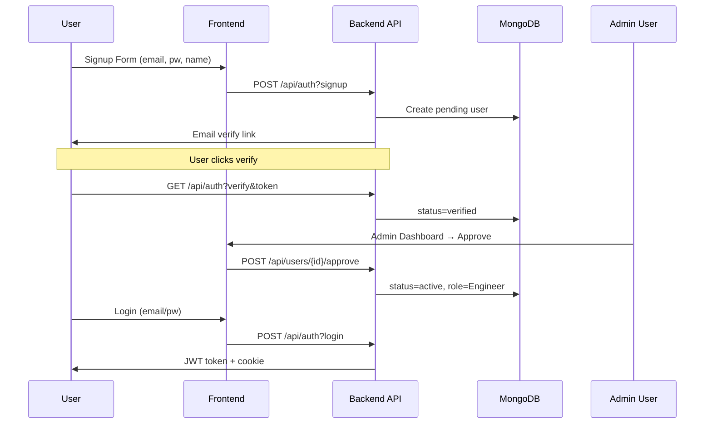

# RoadMaster Pro Replication - Detailed TODO List

This document outlines the complete step-by-step plan to replicate **RoadMaster Pro**, a comprehensive infrastructure/road project management application. The app features project portfolio management, interactive GIS mapping, RFI workflows, financial tracking (BOQ/Billing), RBAC security, offline support, and real-time collaboration.

## 🎯 App Overview
- **Core Functionality**: Project selection → Dashboard (metrics SPI/CPI/S-Curve) → Map Intelligence (KML/GeoJSON/Shapefile/Leaflet) → RFI Workflow → BOQ/Financial/Billing → Messages/Audit.
- **Tech Stack**: React 18.2 + Vite 6 + TS 5.8 + Tailwind 4 + Radix UI + TanStack Table v8 + Framer Motion v12 + Recharts + Zod validation + Sonner toasts.
- **Backend**: Vercel Node API (Express/MongoDB/Mongoose auth) + Supabase (PostGIS data?) + Dual DB support.
- **Key Libs**: react-leaflet, @turf/turf (geo), pdfjs/jspdf (docs), xlsx (exports).

**Exact Dependencies** (from package.json):
```
Frontend/UI: @radix-ui/*, lucide-react, class-variance-authority, clsx, tailwind-merge, sonner
Maps: leaflet 1.9, react-leaflet 4.2, leaflet-geosearch, @turf/turf 7, shapefile, topojson
Data/Chart: @tanstack/react-table 8.21, recharts 2.13, xlsx 0.18
Auth/DB: mongodb 7.2, mongoose 9.5, @supabase/supabase-js 2.103, jsonwebtoken 9, bcryptjs 3
```
- **Key Flows**: Auth/Login → Project Switcher → RBAC-protected Modules → Offline Sync.
- **Registration Workflow**: Extend existing login-only auth with public signup + email verification + admin approval.

## 📋 Phase 1: Project Setup & Dependencies [ ]
### 1.1 Initialize Frontend
- [ ] `npm create vite@latest roadmaster-pro -- --template react-ts`
- [ ] `npm i react@^18.2.0 react-dom@^18.2.0 lucide-react@0.460.0 @tanstack/react-table@^8.21.3 framer-motion@^12.34.3 recharts@2.13.3 sonner@^2.0.7`
- [ ] UI Primitives: `npm i @radix-ui/react-* class-variance-authority@^0.7.1 clsx@^2.1.1 tailwind-merge@^3.4.0 tailwindcss-animate@^1.0.7`
- [ ] Maps: `npm i leaflet@^1.9.4 react-leaflet@^4.2.1 @turf/turf@^7.1.0 leaflet-geosearch@^4.2.2 shapefile@^0.6.6`
- [ ] Tailwind: `npx tailwindcss@^4.1.18 init -p`, configure files
- [ ] Add Vite plugins: React, TSConfig paths
- [ ] Create folder structure: `src/{api,components/{ui,core,common},hooks,lib,types}`

### 1.2 Backend Setup (Vercel API)
- [ ] Create `api/` folder with `package.json` (minimal deps: mongodb, bcryptjs, jsonwebtoken)
- [ ] Setup MongoDB Atlas cluster + connection string in `.env`
- [ ] Create `lib/mongodb.ts` for client connection pooling

### 1.3 TypeScript Globals
- [ ] Define types: `User`, `Project`, `RFI`, `BOQItem`, `Permission`, `RoadAlignment`
- [ ] RBAC enums: `Role.Admin | PM | Engineer`, `Permission.PROJECT_READ | USER_MANAGE`

## 🔐 Phase 2: Authentication & Registration Workflow [ ]



### 2.1 Backend (`api/auth.ts`, deps: mongodb^7.2, mongoose^9.5, bcryptjs^3.0, jsonwebtoken^9.0)
- [ ] Login: `getUserByEmail` → `verifyPassword` → `generateToken({userId, role})` → Set `roadmaster-access` cookie (7d)
- [ ] **Enhanced Signup Flow** (add to auth.ts or separate /api/registrations.ts):
  | Step | Endpoint | Validation (Zod) | DB Schema (Mongoose) |
  |------|----------|------------------|----------------------|
  | Signup | POST /signup | z.object({email, pw>8, name, company}) | users: {email, passwordHash, status:'pending', createdAt} |
  | Verify | GET /verify?token | JWT verify | UPDATE status='verified' |
  | Approve | PATCH /users/:id/approve | Admin auth | UPDATE {status:'active', role:'Engineer\|PM'} |
- [ ] `api/users.ts`: Admin CRUD (list, approve/reject, roles)
- [ ] Utils: `hashPassword`, `verifyPassword`, `generateToken`, `mapUserFromDb`

### 2.2 Frontend Auth (`hooks/useAuth.tsx`)
- [ ] Context Provider: Load user from cookie/JWT
- [ ] Login form: email/password → API call → store token/user
- [ ] ProtectedRoute: Redirect unauth to /login
- [ ] Signup flow: Form → API signup → "Check email" → Login after approval

## 🏗️ Phase 3: Core UI Components (`components/ui`) [ ]
| Component | Path | Features | Dependencies |
|-----------|------|----------|--------------|
| DataTable | ui/data-table.tsx | Sort/Filter/Paginate/Column Visibility | @tanstack/react-table |
| EmptyState | ui/empty-state.tsx | Icon/Title/Desc/Action | lucide-react |
| SearchInput | ui/search-input.tsx | Debounced input | useDebounce hook |
| Shimmer | ui/shimmer.tsx | Loading skeleton | Tailwind animations |
| ErrorSummary | ui/error-summary.tsx | Form validation display |  |

### 3.1 RBAC Components (`components/common`)
- [ ] `HasPermission(permission: Permission)`: Conditional render
- [ ] `ProtectedTab(permission)`: Full view guard

## 📱 Phase 4: Layout & Navigation (`components/core`) [ ]
- [ ] `AppHeader`: Logo, GlobalSearch (Ctrl+K), SyncStatus, UserProfile dropdown
- [ ] `AppSidebar`: Collapsible, RBAC sections (Dashboard, Map, RFI, BOQ)
- [ ] `ProjectSelector`: Initial screen - List/Search/Switch projects
- [ ] PageTransition: Framer Motion fade/slide

## 📊 Phase 5: Main Modules & Workflows [ ]
### 5.1 Project Selector (`/projects`) [x]
- [x] Fetch user projects via `api/projects`
- [x] Search/Filter by name/code
- [x] Click → Set active project → Route to Dashboard

### 5.2 Operations Dashboard (`/dashboard`) [x]
- [x] Metrics cards: SPI/CPI, Progress vs Time, Financial S-Curve
- [x] Charts: Recharts or Tanstack Charts (Implemented with Recharts)

### 5.3 Map Intelligence (`/map`)
- [ ] Leaflet map + KML overlays (`utils/kmlParser.ts`)
- [ ] Layers: Roads, Parcels, Assets (vehicles/staff GPS)
- [ ] Draw tools, measurements

### 5.4 RFI Workflow (`/rfi`)
| Status | Action | API | UI |
|--------|--------|-----|----|
| Draft | Create | POST /api/rfi | Form + Map pin |
| Open | Submit | PATCH /api/rfi/{id}/submit | List view |
| Pending | Assign Inspector | Admin assign | Status badge |
| Resolved | Approve/Reject | PATCH /api/rfi/{id}/resolve | History timeline |

### 5.5 Financial/BOQ (`/boq`)
- [ ] DataTable: Items, Qty, Rate, %Complete, Amount
- [ ] Billing runs, Variations approval

### 5.6 Messages (`/messages`)
- [ ] Inbox, Direct chat, Announcements

## 🔄 Phase 6: Advanced Features [ ]
- [ ] Offline Support: MSW mocks + localStorage + Background Sync
- [ ] Global Search: Fuse.js across projects/docs/RFIs
- [ ] Keyboard Shortcuts: `useKeyboardShortcuts`
- [ ] File Uploads: `api/files.ts` + Progress
- [ ] Audit Logs: Track actions

## 🧪 Phase 7: Testing & Deployment [ ]
- [ ] Vitest: Unit (components, utils), E2E (Playwright)
- [ ] Deploy: Vercel (frontend+api), MongoDB Atlas
- [ ] Seed: Admin user, Sample projects/RFIs/BOQ

## 🔄 Alternative Stack: Python/FastAPI + React [Optional MVP]
For Python preference (faster backend dev, Pydantic validation):
```
Backend: FastAPI + SQLAlchemy + Alembic + PostgreSQL + JWT
Frontend: Same React/Vite stack
Auth: FastAPI Users (OAuth2/JWT)
Maps: Folium/Leaflet (same)
Deploy: Railway/Docker
```
- Pros: Typed schemas (Pydantic), auto-docs (Swagger), async.
- Migration: ~20% less JS boilerplate.

## 🚀 Deployment & Scripts (Match Original)
```
"dev:all": "concurrently \"npm run dev\" \"tsx api/server.mjs\""
"build-prod": "vite build"
Deploy: vercel --prod
Seed: node seed-admin.cjs (create first admin)
```

**Next Steps**:
1. `npm run dev:all` (frontend:5173, api:3001)
2. Create admin → Approve test user
3. Test flows: Project→Map (KML import)→RFI submit→BOQ update
4. E2E: `npm run test:e2e` (Playwright)

**Timeline**: 3-5 weeks MVP (JS), 2-4 weeks (Python alt).
**Priority**: 1.Auth 2.Layout 3.Projects 4.Map 5.RFI/BOQ 6.Offline/RBAC.

Track progress by checking [ ] → [x] here!
